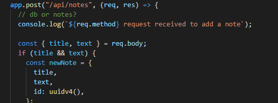

# Note Taker
This is a basic note taking design that allows you to take notes and save them.

## Getting Started

Go to the URL and type in your first note.

# Adding a unique id to each note

# My Portfolio Link
* [Portfolio](https://alix1713.github.io/nextstep/)
* [Github](https://www.github.com/Alix1713/nextstep)

## Built With

* [HTML](https://www.w3schools.com/html/html_intro.asp)
* [CSS](https://css-tricks.com/snippets/css/complete-guide-grid/)
* [UC Berkeley Extension Program](https://extension.berkeley.edu/)
* [NPM package](https://www.npmjs.com/package/uuid)

## Alix Friedman

* [My GitHub](https://www.github.com/Alix1713)
* [My LinkedIn](https://www.linkedin.com/in/alix1713)

## Acknowledgments

*My tutor Chris B. for helping me find the error in the html file that was throwing my code off and spending time teaching me how to reverse engineer code and troubleshoot problems.
